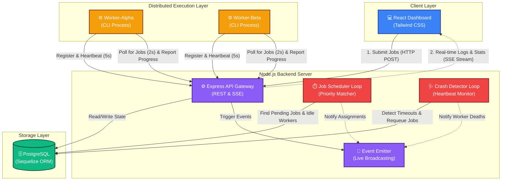

# System Architecture Diagram

Below is a visual representation of the Distributed Job Execution Platform's architecture. 

It illustrates how the frontend dashboard, backend API, background loops, database, and standalone worker processes interact with each other.

## How to view this diagram:
If you are viewing this on **GitHub**, the diagram above will render automatically. 
If you are viewing this in an IDE like VS Code, you can use the built-in Markdown Preview or install a "Mermaid Preview" extension to see the visual flowchart.
